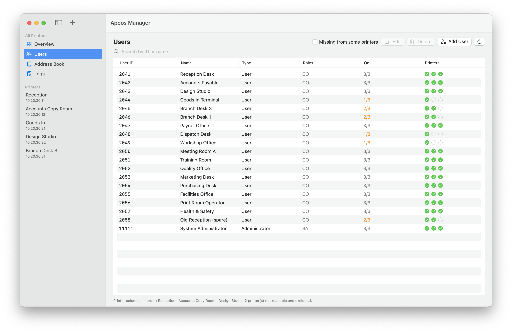
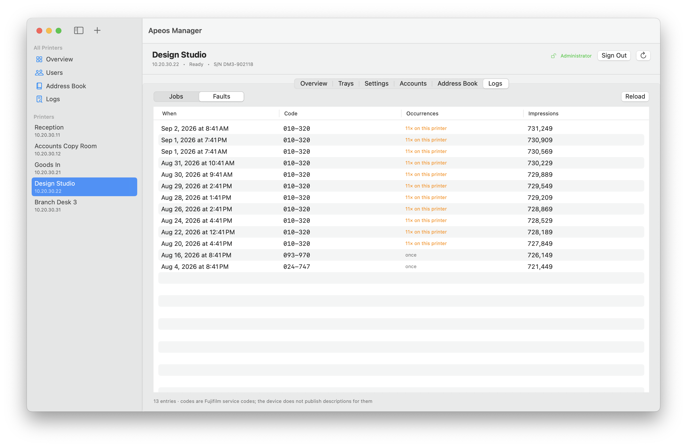
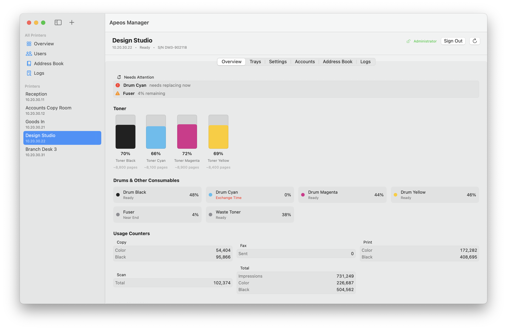
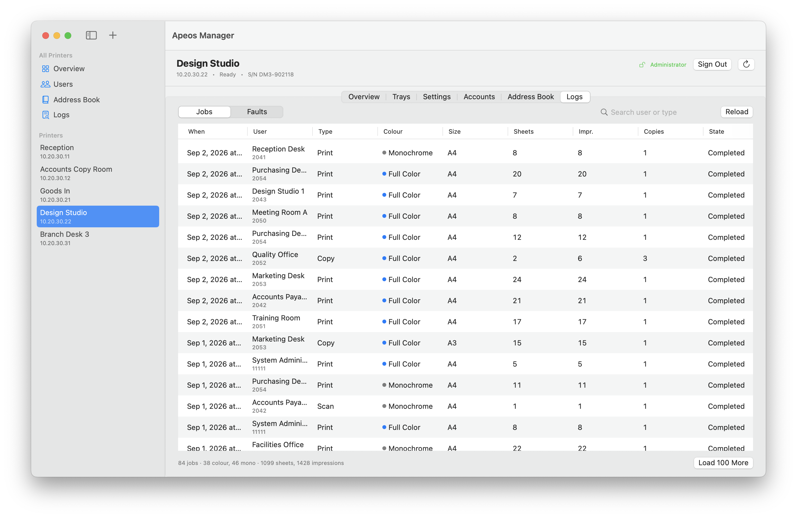
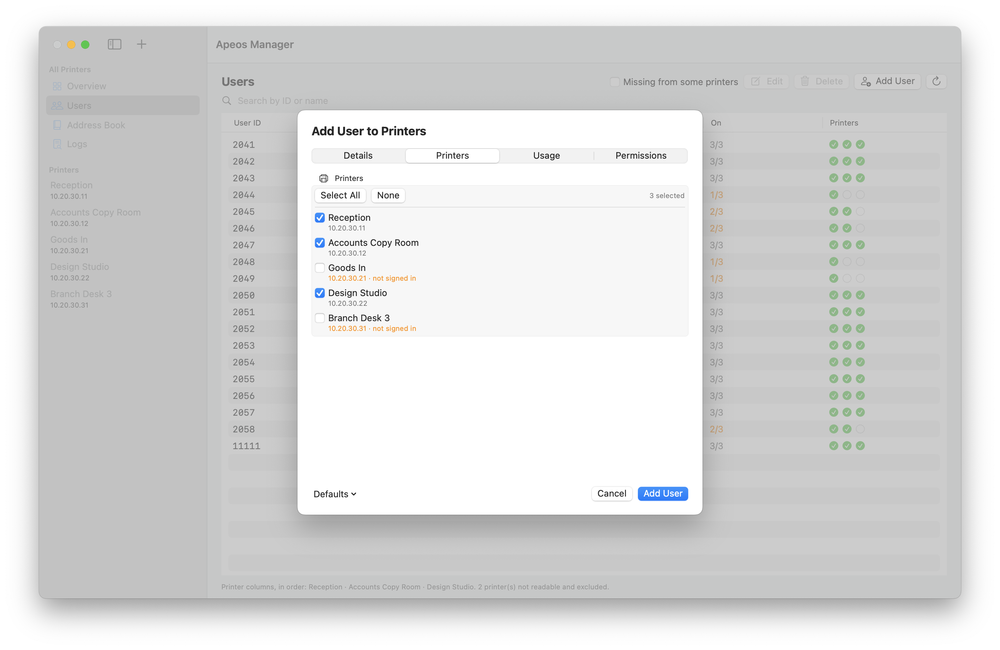
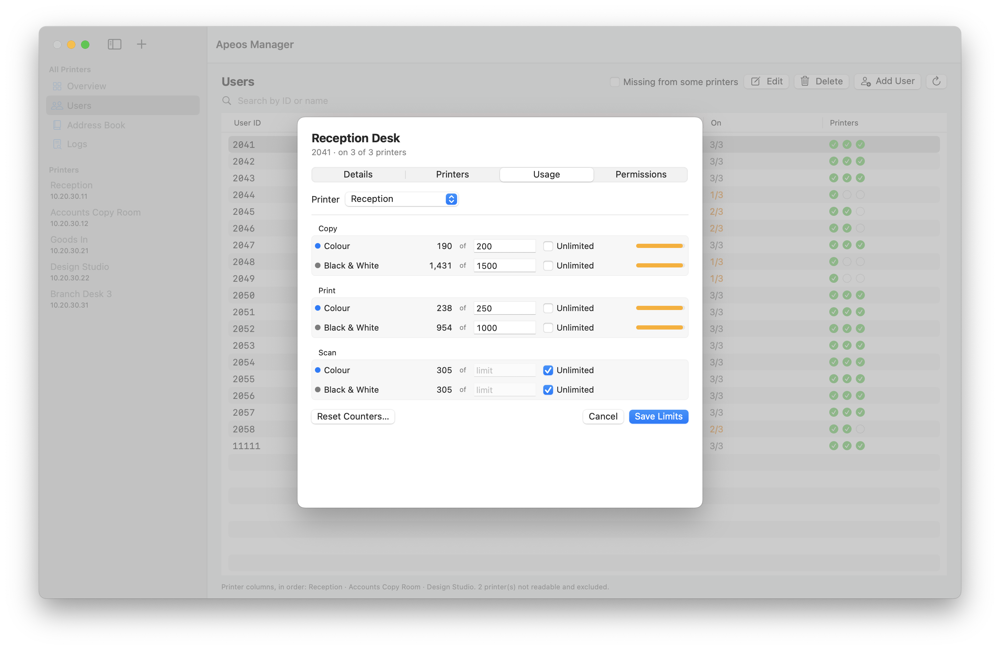
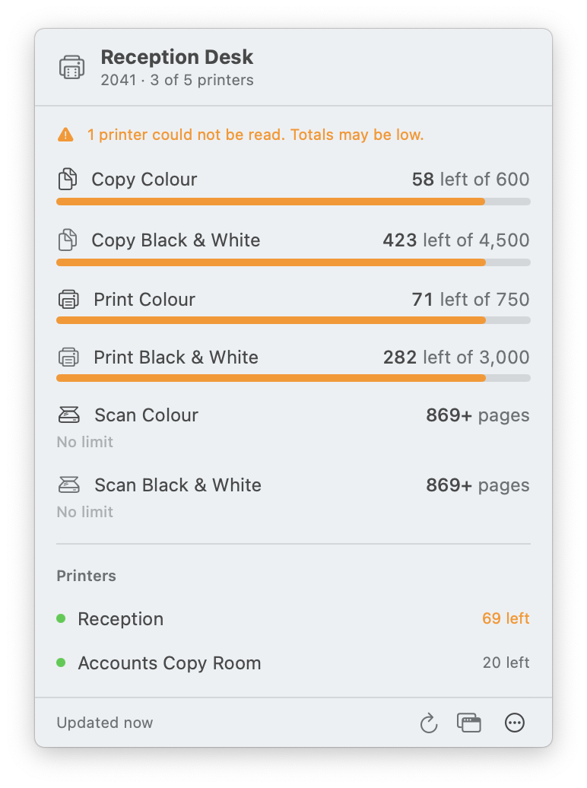
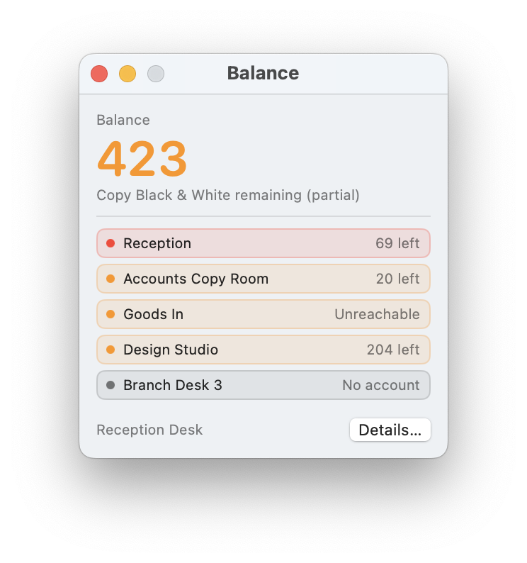

# Apeos Manager

A macOS app for managing a fleet of FUJIFILM Apeos / ApeosPort multifunction printers:
supply levels, trays, device settings, user accounts, accounting limits, address books,
and job and fault logs — across every printer at once.

Built against Apeos C6570 / C3570 / C3530 devices. No vendor SDK is required.

**[Overview and screenshots](https://tony-nz.github.io/ApeosManager/)** ·
**[Documentation](https://tony-nz.github.io/ApeosManager/documentation.html)** ·
**[Download](https://github.com/tony-nz/ApeosManager/releases/latest)**

The project builds two apps from one shared core:

| App | For | What it does |
| --- | --- | --- |
| **Apeos Manager** | administrators | the whole fleet — everything below |
| **Apeos Quota** | ordinary users | your own printing allowance, in the menu bar |

`Sources/Shared` holds the models and the transport both use; `Sources/Admin` and
`Sources/Quota` hold one app each.

[](docs/screenshots/fleet-overview.png)

The reason for the app, in one screen. **Design Studio reports "Ready"** — its own panel
and its status endpoint both say so — while the drum inside it is finished and its fuser
has four per cent left. A device that reports its own trouble needs no fleet manager to
find it; the one that does not is the reason this exists.

## Features

- **Fleet overview** — status, toner and drum levels, counters, and a "needs attention"
  list aggregated across all printers.
- **Users** — the union of user accounts across the fleet, showing which printers hold
  each account. Create a user on many printers at once; edit membership per printer.
- **Account usage** — per-user copy / print / scan meters, colour and mono, with
  editable limits and counter reset.
- **Permissions** — per-user feature access for copy, fax, scan and print (free access,
  black & white only, colour only, no access), which login methods the panel accepts,
  the device role, the permission group, and the "From" address used when that user
  scans to email.
- **Address book** — per printer and merged fleet-wide, with favourites.
- **Logs** — job history (who printed what, colour, size, sheets, impressions) and the
  device fault log, per printer and fleet-wide.
- **Discovery** — subnet scan to find printers.
- **Menu bar** — fleet status at a glance.

## Apeos Quota — the user app

A menu bar app that shows one person their own allowance across the fleet. It signs in
as that person, with their own user ID and passcode, and never holds an administrator
credential — the device lets an ordinary user read their own accounting meters, which is
what makes a standalone app possible instead of a relay service.

- **Menu bar** — pages remaining on the meter closest to running out, or pages used
  where nothing is capped.
- **Popover** — every meter, and your last few jobs.
- **Window** — the same, plus where each printer stands individually and a longer
  history.
- **Fleet totals** — usage adds up across printers. A printer that leaves a meter
  uncapped uncaps it fleet-wide, because the user really is uncapped for it; summing
  `9999999` into the total would invent a huge but finite allowance instead.
- **Partial results** — an unreachable printer costs its own numbers, not the refresh.
  Totals then say they are a lower bound rather than passing a short count off as fact.

Three constraints shape it, each measured against hardware:

- **The device will not filter to one user here.** Every filter shape this app sends
  is rejected with HTTP 500, so the whole directory comes back and is narrowed in the
  client. Nothing but the signed-in user's own records is kept, published or displayed.
  (`UserIDs/UserID` is the one shape the device's own UI uses and the manager app tries
  it first; whether an ordinary `CO` session may use it has not been established.)
- **`UsernameToken` is refused (401).** The `/LOGIN.cmd` session cookie is the only
  credential an ordinary user has.
- **Sessions are scarce.** These devices allow only a few at once and this app runs on
  every desk, so each refresh signs in, reads, and signs out; nothing is held between
  refreshes. The default interval is 15 minutes.

## Screenshots

Click any of these to see it full size. All were taken from the demo fleet below, with
`tools/shots/capture.sh` — there is more of the tour on the
[site](https://tony-nz.github.io/ApeosManager/#screenshots).

| | |
| --- | --- |
| [](docs/screenshots/fleet-users.png) | [](docs/screenshots/printer-faults.png) |
| **Users across the fleet** — every account, and which printers hold it. | **Fault logs** — repeats counted, because one is noise and eleven is a service call. |
| [](docs/screenshots/printer-overview.png) | [](docs/screenshots/printer-jobs.png) |
| **One printer** — toner, drums, consumables and counters. | **Job history** — who printed what, per printer and fleet-wide. |
| [](docs/screenshots/add-user-printers.png) | [](docs/screenshots/edit-user-usage.png) |
| **Adding a user** — on many printers at once, with limits and permissions. | **Accounting limits** — per user, per printer, with counter resets. |
| [](docs/screenshots/quota-menu-bar.png) | [](docs/screenshots/quota-balance.png) |
| **Apeos Quota** — what is left, in your menu bar. | **Balance** — and where each printer stands, including the ones that failed. |

## Try it without a printer

Both apps contain a fictional fleet. Launch either with `-demoMode YES`:

```sh
/Applications/Apeos\ Manager.app/Contents/MacOS/ApeosManager -demoMode YES
/Applications/Apeos\ Quota.app/Contents/MacOS/ApeosQuota     -demoMode YES
```

Five printers and nineteen accounts, holding one of every state the apps distinguish:
unreachable, low on toner, refusing reads without an administrator session, and a device
reporting itself Ready while a drum inside it is spent. Every screenshot on the site was
taken from it, with `tools/shots/capture.sh`.

A demo run contacts nothing on your network, reads no credential from your keychain and
writes nothing to your settings — `ApeosClient.init` throws under the flag, so there is
no path by which it could. See `Sources/Shared/Demo/DemoMode.swift`.

## Building

Requires Xcode and [XcodeGen](https://github.com/yonaskolb/XcodeGen).

```sh
export APEOS_SIGN_IDENTITY="Apple Development: Your Name (TEAMID)"
./build.sh                # both apps
./build.sh ApeosQuota     # just the user app
```

`security find-identity -v -p codesigning` lists available identities.

Signing is not optional in practice: keychain access is bound to the app's code
identity, so an unsigned build cannot read printer passwords saved by a previous build.

### Releases

```sh
./Scripts/release.sh 1.0.0 --skip-notarize   # build and sign only; not distributable
./Scripts/release.sh 1.0.0                   # build, sign, notarise, staple
./Scripts/release.sh 1.0.0 --publish         # ...then tag, push and create the release
```

Both apps ship in one zip, universal, signed with a Developer ID certificate and
notarised. The script refuses to run on a dirty tree, over an existing tag, without a
Developer ID certificate or notary credentials, or if a bundle would be signed under an
identifier that does not match the one its keychain items were saved under.

## The device API

None of this is publicly documented; it was derived by reading the web UI bundle each
device serves and verifying every call against real hardware. Two API families exist.

### JSON REST

Authenticated by a session cookie from `POST /LOGIN.cmd`, which takes form fields
`NAME` and `PSW`, each **Base64-encoded**, and answers `{"result":"0"}` on success.

| Endpoint | Purpose |
| --- | --- |
| `/home/api/device-status` | Status. Served without authentication on every model tested — the reliable discovery probe. |
| `/home/api/about` | Name, serial, firmware, contact fields |
| `/home/api/supplies-info` | Toner and drum levels |
| `/home/api/billing-counter` | Lifetime counters |
| `/home/api/paper-tray` | Tray sizes, media, status |
| `/home/api/faulthistory` | Fault log |
| `/jobs/api/job-list` | Job history |
| `/addressbook/api/addressbook` | Address book |
| `/permissions/api/*` | Capability descriptors only — **not** account data |

### SOAP (SSMI)

User, account and role records live here, not in the JSON API. SOAP 1.1, namespaces
are `http://www.fujifilm.com` + the service path, endpoints `/ssm/Management/Aaa/<Service>`.
The `/LOGIN.cmd` cookie authenticates; the `UsernameToken` header is optional.

## Findings worth knowing

Behaviour that is easy to get wrong, each confirmed against hardware:

- **Endpoint exposure varies by model.** Some devices serve `/home/api` anonymously;
  others return 403 for everything except `device-status`. Sign in before reading.
- **`GetUserInformation` `Responds` paths are relative to each `User`** —
  `Authentication/UserID`, not `Users/User/Authentication/UserID`. The prefixed form
  belongs to a different operation and silently selects nothing, returning HTTP 200
  with an empty result.
- **User types are `KO` and `CO`** (key operator / customer operator).
- **An ordinary `CO` session may call `GetUserInformation`.** This is what the user app
  is built on. It is also unscoped as called there: the caller gets every user's record,
  and `Users/User/Authentication/UserID`, a bare `UserID` and `Condition/UserID` are all
  rejected with HTTP 500, so that client narrows the result itself. The same is true of
  `/jobs/api/job-list`, which is device-wide.
- **`/permissions/api/*` is the boundary that does hold** — 403 for a `CO` user, so
  accounting configuration stays administrator-only.
- **Sort order is `ascending`**, not `asc`; the abbreviation is rejected as
  `flt:InvalidMessage`.
- **`GetAccount` requires an `AccountType` element**, empty for all.
- **Creating a user uses `AddUserInformation` with an `Authentication` block only.**
  Including `Accounting` in the same request is rejected. Name and password are applied
  afterwards with `SetUserInformation`, which only works once the record exists.
- **A display name persists only via `Authentication/UserName`.** Writing
  `Accounting/UserName` returns success and discards the value.
- **Deleting a user does not use the `Users/User` shape** — its schema is
  `Category` (the literal string `Authentication`) plus `User{UserType, UserID}`.
- **`job-list` rejects any limit above 20** with HTTP 500. Paging uses
  `offsetJobID` plus `offsetJobIDType`, where the type is the previous job's *state*
  (`COMPLETED`), not a direction keyword.
- **`/addressbook/api/addressbook` requires `lang`**; without it every request is
  `400 INVALID_PARAMETER`. Its `ContactCount` is an *object* of per-channel totals with
  the real total nested inside under the same name.
- **One user can be selected with `UserIDs/UserID`.** This is the shape the device's
  own account page sends, and it leads the operation's schema sequence, ahead of
  `UserTypes`, `Sort`, `Scope` and `Responds` — it is not among the shapes above that
  fail. The manager app tries it and falls back to walking the collection, which also
  tells a rejected filter apart from an unimplemented `Responds` path: only the latter
  faults on the unfiltered request too.
- **Per-user permissions live on the same operation as the meters**, under
  `Authentication/MailAddress`, `Authentication/ProhibitLoginWith/{ManualEntry,CardEntry}`,
  `Authorization/TraditionalRole`, `Authorization/PermissionGroup/{Index,Name}` and
  `Authorization/ColorModePermission/{Copy,Fax,Scan,Print}`. A `Responds` path may name a
  child, not only a block.
- **`ProhibitLoginWith` is stored inverted.** A `true` child *prohibits* that login
  method, so the panel's "User ID Login" is `ManualEntry` false with `CardEntry` true.
  A device with no card reader reports no `CardEntry` at all.
- **Colour access values differ per service.** Copy takes `All`, `Monochrome`,
  `LimitedColorAndMonochrome`, `Color`, `None`; scan drops `LimitedColorAndMonochrome`;
  print swaps `Color` for `ColorAndLimitedColorAndMonochrome`; fax takes only `All` and
  `None`. `TraditionalRole` is `SA`, `AA` or `CO`.
- **A `Responds` path naming an element the model lacks faults the whole request**
  rather than omitting that one value — a device with no fax rejects a request asking
  for `ColorModePermission/Fax` alongside everything else. The permission read drops the
  accessory-dependent paths and retries before giving up.
- **Writes can succeed without applying.** Several operations return HTTP 200 with no
  fault and store nothing, so the app re-reads after every write and reports mismatches.

## Tools

`tools/` holds the probe scripts used to derive and verify the above. All read the
administrator password from the tty — never from a file, argument or environment
variable — and take the printer host as an argument.

Scripts prefixed `test-` that create, edit or delete records write to a live device.
They confirm before running and verify each step by reading back.

## Licence

MIT
